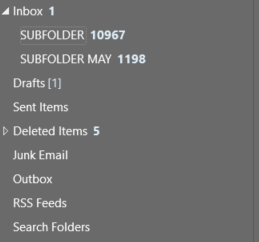
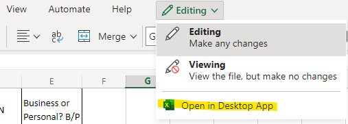
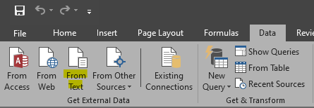
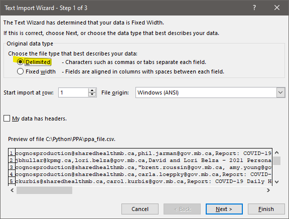
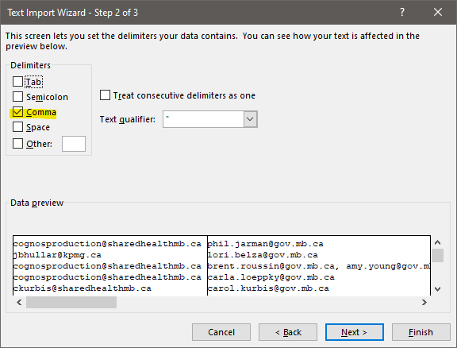
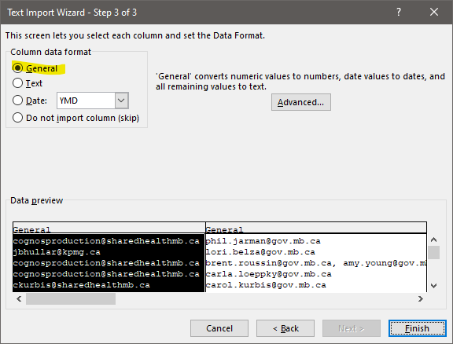
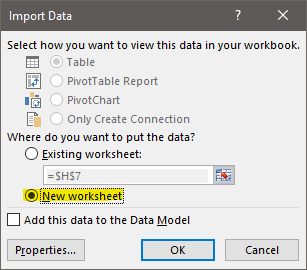

# Outlook Email Exporter

> Loops through all emails from an outlook mailbox and grabs their information such as sender, recipient, body, date, etc.

Fork the repo here: <https://github.com/joshualorenzodev/outlook-exporter>

---

## 1. Install Python and modules

Install Python here: <https://www.python.org/downloads/>

Install the `pywin32` module with the command below.

Learn more about it here: <https://pypi.org/project/pywin32/>

```bash
pip install pywin32
```

Enter command below to check if it's installed with the latest version.

```bash
pip list
```

Import the required modules.

```python
import win32com.client
import time
import csv
from datetime import date, datetime, timedelta
```

---

## 2. Create variables

❗ Make sure the folder structure is correct.

I would create a subfolder and copy the filtered emails from the original folder to this new folder.



```python
# Grabs the Outlook application using the win32 module
outlook = win32com.client.Dispatch("Outlook.Application").GetNamespace("MAPI")

# Grabs the Inbox (6) folder or a subfolder (SUBFOLDER) within Inbox
inbox = outlook.GetDefaultFolder(6).Folders["SUBFOLDER"]

# Grabs the emails in the Inbox or specified SUBFOLDER
messages = inbox.Items

# Sorts the emails by the time it was received (oldest to newest)
messages.Sort("[ReceivedTime]", Descending=False)

```

---

## 3. Loop through the list

```python
with open('C:/PATH/TO/CSV_FILE.CSV', 'w') as CSV_FILE:
    writer = csv.writer(CSV_FILE)

    # Loops through each message in messages
    for message in messages:

        # Grabs the index of the ">" character's and adds 1 
        index = message.Body.index(">") + 1

        # Uses the index above to grab the relevant part of the message body
        body = message.Body[index:-3]

        # Splits the message body into sender, recipient, and subject line
        # Also checks if there is a sender and a subject
        if len(body.split("\r\n")) != 5:
            sender = body.split("\r\n")[1]
            recipient = body.split("\r\n")[2]
            subject = "No Subject"
        else:
            sender = body.split("\r\n")[1]
            recipient = body.split("\r\n")[2]
            subject = body.split("\r\n")[3]

        # Creates a row with the sender, recipient, and subject for each email found in the body
        writer.writerow([sender, recipient, subject])

# Prints how many emails were exported
print(len(messages))
```

---

## 4. Export the .csv file

Open a terminal or built-in terminal on your IDE and `cd` into the folder containing the script.

```bash
cd C:\PATH\TO\outlook_export.py
```

Run the command below to generate the .csv file.

Take note of the output of how many emails were exported.

```bash
python outlook_export.py
```

---

## 5. Import the .csv file into Excel

1. Open the Excel desktop app instead of the web app.

    

2. Go on the `Data` tab and import .csv file `from text`.

    

3. Select the .csv file and click the `Delimited` radio button and click next.

    

4. Select the `Comma`  option.

    

5. Select `General` option and click `Finish`.

    

6. Select `New Worksheet` option or import it to an existing worksheet and click `OK`.
   
